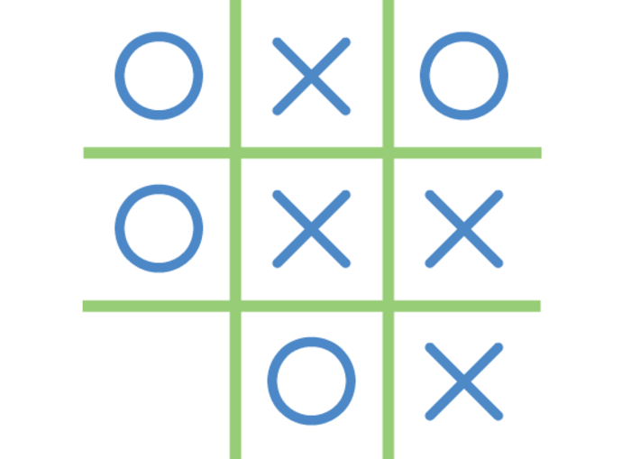
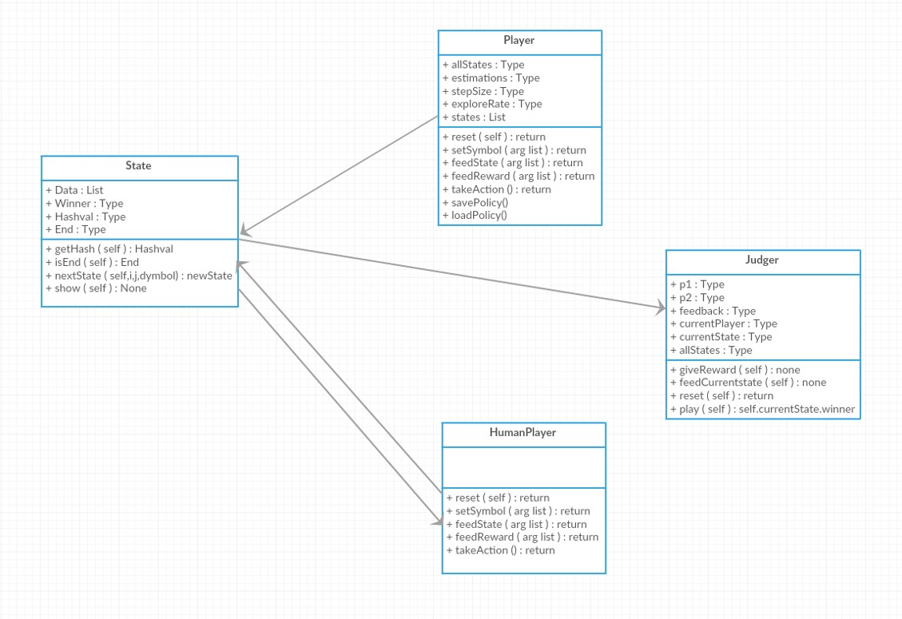

# Reinforcement Learning

* Reinforcement Learning is a type of Machine Learning, and thereby also a branch of Artificial Intelligence. 
* It allows machines and software agents to automatically determine the ideal behaviour within a specific context, in order to maximize its performance. 
* Simple reward feedback is required for the agent to learn its behaviour; this is known as the reinforcement signal.

## Case Study - Tic Tac Toe Example



* The reinforcement learning for the Tic Tac Toe game is analyzed

### Class Diagram




### References


* http://reinforcementlearning.ai-depot.com/
* https://web.archive.org/web/20161012193604/https://webdocs.cs.ualberta.ca/~sutton/book/bookdraft2016sep.pdf


```python

```
